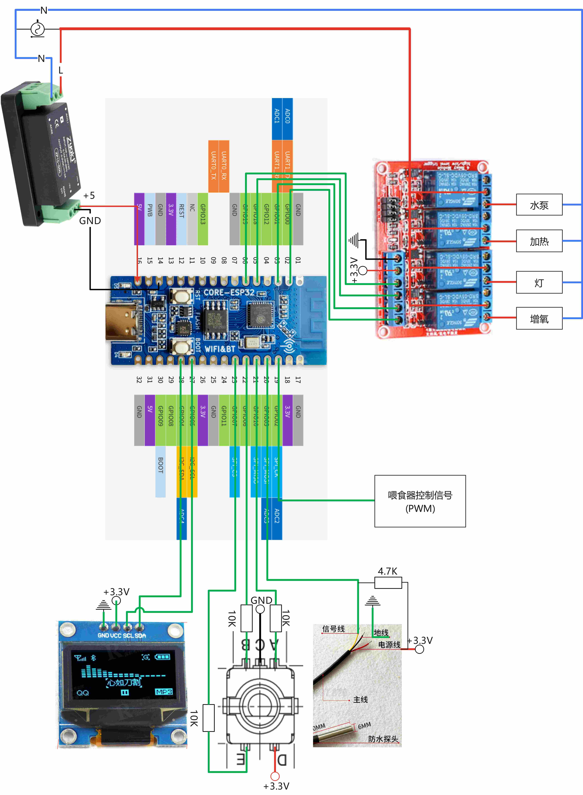

# ProjectName

ProjectName and Description

<!-- PROJECT SHIELDS -->

[![Contributors][contributors-shield]][contributors-url]
[![Forks][forks-shield]][forks-url]
[![Stargazers][stars-shield]][stars-url]
[![Issues][issues-shield]][issues-url]
[![MIT License][license-shield]][license-url]
[![LinkedIn][linkedin-shield]][linkedin-url]

<!-- PROJECT LOGO -->

<br />

<p align="center">
  <a href="https://github.com/shaojintian/Best_README_template/">
    
  </a>

<h3 align="center">智能鱼缸控制器</h3>
  <p align="center">
    一个基于ESP32-C3的智能鱼缸控制器
    <br />
    <a href="https://github.com/shaojintian/Best_README_template"><strong>探索本项目的文档 »</strong></a>
    <br />
    <br />
    <a href="https://github.com/shaojintian/Best_README_template">查看Demo</a>
    ·
    <a href="https://github.com/shaojintian/Best_README_template/issues">报告Bug</a>
    ·
    <a href="https://github.com/shaojintian/Best_README_template/issues">提出新特性</a>
  </p>

</p>

 本篇README.md面向开发者

## 目录

- [上手指南](#上手指南)
  - [开发前的配置要求](#开发前的配置要求)
  - [安装步骤](#安装步骤)
- [文件目录说明](#文件目录说明)
- [开发的架构](#开发的架构)
- [部署](#部署)
- [使用到的框架](#使用到的框架)
- [贡献者](#贡献者)
  - [如何参与开源项目](#如何参与开源项目)
- [版本控制](#版本控制)
- [作者](#作者)
- [鸣谢](#鸣谢)

### 上手指南

请将所有链接中的“shaojintian/Best_README_template”改为“your_github_name/your_repository”

###### 开发前的配置要求

1. xxxxx x.x.x
2. xxxxx x.x.x

###### **安装步骤**

1. Get a free API Key at [https://example.com](https://example.com)
2. Clone the repo

```sh
git clone https://github.com/shaojintian/Best_README_template.git
```

### 文件目录说明

```
./
├─images # 文档图片
├─prints # 打印件
└─smart-fish-tank # 控制源码
    ├─.pio
    │  └─build
    │      └─esp32-c3-devkitm-1
    ├─.vscode
    ├─include
    ├─lib
    ├─src
    └─test
```

### 硬件清单

| 序号  | 名称          | 规格                     | 数量  | 备注           |
| --- | ----------- | ---------------------- | --- | ------------ |
| 1   | ESP32-C3开发板 | 合宙 Core-Esp32-C3       | 1   |              |
| 2   | AC-DC模块     | 220V - 5V 5A           | 1   |              |
| 3   | EC11        |                        | 1   |              |
| 4   | DS18b20     | 不锈钢封装/防水型              | 1   |              |
| 5   | 10K电阻       | 10K 1%                 | 3   |              |
| 6   | 4.7K电阻      | 4.7K 1%                | 1   | 可以用两个10k并联替代 |
| 7   | OLED模块      | 0.96寸 单色 OLED 模块 I2C接口 | 1   |              |
| 8   | 继电器模块       | 4路，带光耦                 | 1   |              |

### 接线示意图



### 

### 部署

暂无

### 使用到的框架

- [arduino](https://www.arduino.cc/)
- 

### 贡献者

请阅读**CONTRIBUTING.md** 查阅为该项目做出贡献的开发者。

#### 如何参与开源项目

贡献使开源社区成为一个学习、激励和创造的绝佳场所。你所作的任何贡献都是**非常感谢**的。

1. Fork the Project
2. Create your Feature Branch (`git checkout -b feature/AmazingFeature`)
3. Commit your Changes (`git commit -m 'Add some AmazingFeature'`)
4. Push to the Branch (`git push origin feature/AmazingFeature`)
5. Open a Pull Request

### 版本控制

该项目使用Git进行版本管理。您可以在repository参看当前可用版本。

### 作者

xxx@xxxx

知乎:xxxx  &ensp; qq:xxxxxx    

 *您也可以在贡献者名单中参看所有参与该项目的开发者。*

### 版权说明

该项目签署了MIT 授权许可，详情请参阅 [LICENSE.txt](https://github.com/shaojintian/Best_README_template/blob/master/LICENSE.txt)

### 鸣谢

- [GitHub Emoji Cheat Sheet](https://www.webpagefx.com/tools/emoji-cheat-sheet)
- [Img Shields](https://shields.io)
- [Choose an Open Source License](https://choosealicense.com)
- [GitHub Pages](https://pages.github.com)
- [Animate.css](https://daneden.github.io/animate.css)
- [arduino](https://www.arduino.cc/)

<!-- links -->

[your-project-path]:shaojintian/Best_README_template
[contributors-shield]: https://img.shields.io/github/contributors/shaojintian/Best_README_template.svg?style=flat-square
[contributors-url]: https://github.com/shaojintian/Best_README_template/graphs/contributors
[forks-shield]: https://img.shields.io/github/forks/shaojintian/Best_README_template.svg?style=flat-square
[forks-url]: https://github.com/shaojintian/Best_README_template/network/members
[stars-shield]: https://img.shields.io/github/stars/shaojintian/Best_README_template.svg?style=flat-square
[stars-url]: https://github.com/shaojintian/Best_README_template/stargazers
[issues-shield]: https://img.shields.io/github/issues/shaojintian/Best_README_template.svg?style=flat-square
[issues-url]: https://img.shields.io/github/issues/shaojintian/Best_README_template.svg
[license-shield]: https://img.shields.io/github/license/shaojintian/Best_README_template.svg?style=flat-square
[license-url]: https://github.com/shaojintian/Best_README_template/blob/master/LICENSE.txt
[linkedin-shield]: https://img.shields.io/badge/-LinkedIn-black.svg?style=flat-square&logo=linkedin&colorB=555
[linkedin-url]: https://linkedin.com/in/shaojintian
